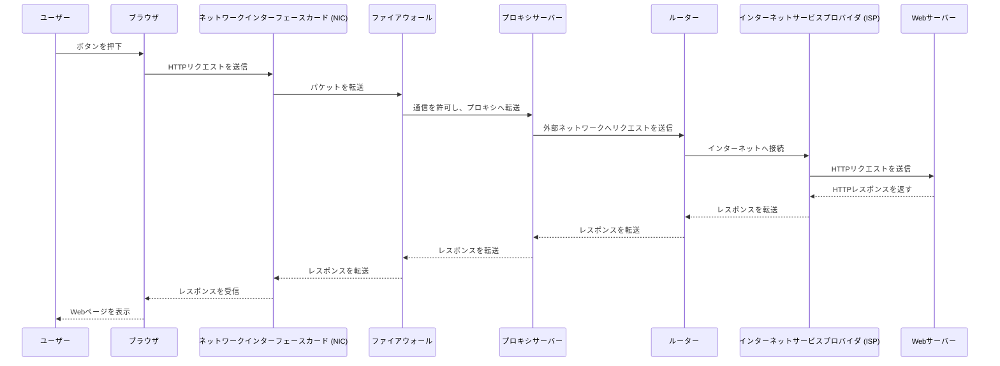
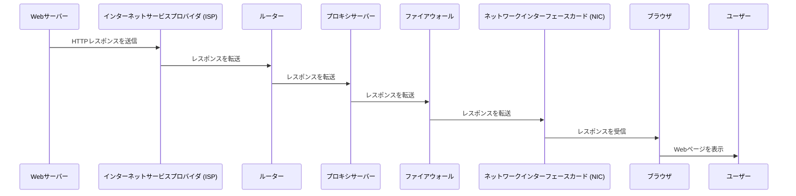

# Linuxネットワーク管理ツール

## 1. `net-tools` パッケージとは？
`net-tools` は、古いネットワーク管理ツールのセットであり、以下のようなコマンドを含みます。

### `net-tools` の主なコマンド
```bash
ifconfig
```
- ネットワークインターフェースの設定や状態を表示
- **非推奨**（現在は `ip` コマンドを使用）

```bash
route
```
- ルーティングテーブルの表示や設定
- **非推奨**（現在は `ip route` を使用）

```bash
netstat
```
- ネットワーク接続やルーティングテーブル、インターフェース統計情報を表示
- **非推奨**（現在は `ss` コマンドを使用）

```bash
arp
```
- ARPキャッシュの操作や表示
- **非推奨**（現在は `ip neigh` を使用）

## 2. `iproute2` パッケージとは？
`iproute2` は、`net-tools` の代替として推奨されるネットワーク管理ツールセットです。  
`ip` コマンドを中心に、より高機能で統一されたネットワーク管理が可能になります。

### `iproute2` の主なコマンド
```bash
ip addr show
```
- ネットワークインターフェースのIPアドレスを表示
- `ifconfig` の代替

```bash
ip route show
```
- ルーティングテーブルの表示
- `route` の代替

```bash
ss -tuln
```
- ネットワーク接続の状態を表示
- `netstat` の代替

```bash
ip neigh show
```
- ARPテーブルの表示
- `arp` の代替

## 3. `ip a` コマンドの詳細
`ip a` は `ip addr show` の省略形で、ネットワークインターフェースのIPアドレスを確認するために使用されます。

### `ip a` の基本的な使い方
```bash
ip a
```
- すべてのネットワークインターフェースのIPアドレスを表示

```bash
ip a show dev eth0
```
- `eth0` インターフェースのIPアドレスのみを表示

```bash
ip addr add 192.168.1.100/24 dev eth0
```
- `eth0` に `192.168.1.100/24` のIPアドレスを追加

```bash
ip addr del 192.168.1.100/24 dev eth0
```
- `eth0` から `192.168.1.100/24` のIPアドレスを削除

### `ip a` の出力例
```plaintext
1: lo: <LOOPBACK,UP,LOWER_UP> mtu 65536 qdisc noqueue state UNKNOWN
    link/loopback 00:00:00:00:00:00 brd 00:00:00:00:00:00
    inet 127.0.0.1/8 scope host lo
    valid_lft forever preferred_lft forever
2: eth0: <BROADCAST,MULTICAST,UP,LOWER_UP> mtu 1500 qdisc fq_codel state UP
    link/ether 52:54:00:12:34:56 brd ff:ff:ff:ff:ff:ff
    inet 192.168.1.10/24 brd 192.168.1.255 scope global dynamic eth0
    valid_lft 3600sec preferred_lft 3600sec
```

## まとめ
- `net-tools` は古いツールセットであり、現在は `iproute2` の使用が推奨される。
- `ip` コマンドを使うことで、より統一されたネットワーク管理が可能。
- `ip a` は `ifconfig` の代替として、ネットワークインターフェースのIPアドレスを確認するために使用される。

# ブラウザからインターネットに出ていくまで

以下に、Linuxサーバーでブラウザを操作し、ボタンを押下した際にインターネットへ通信が出ていくまでの流れをMermaidのシーケンス図で表現しました。  



### 詳細解説
このシーケンス図では、Linuxサーバー上のブラウザがボタンを押下し、インターネットへ通信が出ていくまでの流れを示しています。

1. **ユーザーがブラウザでボタンを押下**  
   - ユーザーがWebページ上のボタンをクリックすると、ブラウザはHTTPリクエストを作成します。

2. **ブラウザがNICへリクエストを送信**  
   - NIC（ネットワークインターフェースカード）は、物理的なネットワーク接続を担当し、データを送信します。

3. **NICがファイアウォールへパケットを転送**  
   - ファイアウォールは、セキュリティポリシーに基づいて通信を許可または拒否します。

4. **ファイアウォールがプロキシサーバーへ転送**  
   - プロキシサーバーは、企業ネットワークなどで使用され、キャッシュやアクセス制御を行います。

5. **プロキシサーバーがルーターへリクエストを送信**  
   - ルーターは、ネットワーク間のデータ転送を担当し、適切な経路を選択します。

6. **ルーターがISPへ接続**  
   - ISP（インターネットサービスプロバイダ）は、インターネットへの接続を提供します。

7. **ISPがWebサーバーへリクエストを送信**  
   - Webサーバーは、ユーザーのリクエストを受け取り、適切なレスポンスを生成します。

8. **Webサーバーがレスポンスを返す**  
   - Webページのデータ（HTML、CSS、JavaScriptなど）を含むレスポンスを送信します。

9. **レスポンスが逆の経路を通ってユーザーへ戻る**  
   - ISP → ルーター → プロキシ → ファイアウォール → NIC → ブラウザへとデータが戻ります。

10. **ブラウザがWebページを表示**  
   - 受信したデータを解析し、ユーザーにWebページを表示します。

この流れを理解することで、Linuxサーバーのネットワーク構成や通信経路の最適化が可能になります。  
また、ファイアウォールやプロキシの設定を適切に行うことで、セキュリティを強化しつつ、効率的な通信を実現できます。

---

インターネットから通信が返ってくるまでの流れを、Mermaidのシーケンス図を使って詳しく解説します。  
レスポンスが戻る際の主要な登場人物として、**Webサーバー、ISP、ルーター、プロキシサーバー、ファイアウォール、NIC、ブラウザ** を含めています。



### 詳細解説
このシーケンス図では、インターネットから通信が返ってくるまでの流れを示しています。

1. **Webサーバーがレスポンスを生成**  
   - ユーザーのリクエストを受け取ったWebサーバーは、適切なデータ（HTML、CSS、JavaScriptなど）を含むHTTPレスポンスを作成します。

2. **WebサーバーがISPへレスポンスを送信**  
   - Webサーバーは、インターネットサービスプロバイダ（ISP）へレスポンスを送信します。

3. **ISPがルーターへレスポンスを転送**  
   - ISPは、適切な経路を選択し、レスポンスをルーターへ転送します。

4. **ルーターがプロキシサーバーへ転送**  
   - ルーターは、企業ネットワークや組織のネットワークにおいて、プロキシサーバーへレスポンスを送信します。

5. **プロキシサーバーがファイアウォールへ転送**  
   - プロキシサーバーは、キャッシュやアクセス制御を行い、ファイアウォールへレスポンスを送信します。

6. **ファイアウォールがNICへ転送**  
   - ファイアウォールは、セキュリティポリシーに基づいて通信を許可し、NICへレスポンスを送信します。

7. **NICがブラウザへレスポンスを送信**  
   - NIC（ネットワークインターフェースカード）は、データをブラウザへ転送します。

8. **ブラウザがWebページを表示**  
   - ブラウザは、受信したデータを解析し、ユーザーにWebページを表示します。

この流れを理解することで、Linuxサーバーのネットワーク構成や通信経路の最適化が可能になります。  
また、ファイアウォールやプロキシの設定を適切に行うことで、セキュリティを強化しつつ、効率的な通信を実現できます。


## **まとめ**
- `ip a` / `ip addr show` : ネットワークインターフェースのIPアドレスを確認。
- `ip route show` : ルーティングテーブルを確認。
- `ip neigh show` : ARPテーブルを確認。
- `ss -tulnp` : ネットワーク接続状況を確認（推奨）。
- `netstat -tulnp` : ネットワーク接続状況を確認（非推奨）。

## 1. `ip a` / `ip addr show`
### **役割**
`ip a` は `ip addr show` の省略形であり、ネットワークインターフェースのIPアドレスを確認するために使用されます。

### **主なオプション**
```bash
ip addr show
```
- `show` : 現在のネットワークインターフェースのIPアドレスを表示。

```bash
ip addr show dev eth0
```
- `dev <インターフェース名>` : 特定のネットワークインターフェースの情報のみを表示。

```bash
ip addr add 192.168.1.100/24 dev eth0
```
- `add <IPアドレス>` : 指定したインターフェースにIPアドレスを追加。

```bash
ip addr del 192.168.1.100/24 dev eth0
```
- `del <IPアドレス>` : 指定したインターフェースからIPアドレスを削除。

### **出力例**
```plaintext
1: lo: <LOOPBACK,UP,LOWER_UP> mtu 65536 qdisc noqueue state UNKNOWN
    link/loopback 00:00:00:00:00:00 brd 00:00:00:00:00:00
    inet 127.0.0.1/8 scope host lo
    valid_lft forever preferred_lft forever
2: eth0: <BROADCAST,MULTICAST,UP,LOWER_UP> mtu 1500 qdisc fq_codel state UP
    link/ether 52:54:00:12:34:56 brd ff:ff:ff:ff:ff:ff
    inet 192.168.1.10/24 brd 192.168.1.255 scope global dynamic eth0
    valid_lft 3600sec preferred_lft 3600sec
```

## 2. `ip route show`
### **役割**
ルーティングテーブル（経路情報）を確認するためのコマンドです。

### **主なオプション**
```bash
ip route show
```
- `show` : 現在のルーティングテーブルを表示。

```bash
ip route add 192.168.2.0/24 via 192.168.1.1 dev eth0
```
- `add <ネットワーク>` : 指定したネットワークへのルートを追加。

```bash
ip route del 192.168.2.0/24
```
- `del <ネットワーク>` : 指定したネットワークへのルートを削除。

### **出力例**
```plaintext
default via 192.168.1.1 dev eth0 proto static
192.168.1.0/24 dev eth0 proto kernel scope link src 192.168.1.10
192.168.2.0/24 via 192.168.1.1 dev eth0
```

## 3. `ip neigh show`
### **役割**
ARPテーブル（IPアドレスとMACアドレスの対応関係）を確認するためのコマンドです。

### **主なオプション**
```bash
ip neigh show
```
- `show` : 現在のARPテーブルを表示。

```bash
ip neigh add 192.168.1.20 lladdr 00:11:22:33:44:55 dev eth0
```
- `add <IPアドレス>` : 指定したIPアドレスとMACアドレスの対応を追加。

```bash
ip neigh del 192.168.1.20 dev eth0
```
- `del <IPアドレス>` : 指定したIPアドレスのARPエントリを削除。

### **出力例**
```plaintext
192.168.1.1 dev eth0 lladdr 00:11:22:33:44:55 REACHABLE
192.168.1.20 dev eth0 lladdr 00:aa:bb:cc:dd:ee STALE
```

## 4. `ss -tulnp`
### **役割**
現在のネットワーク接続状況を確認するためのコマンドです。

### **主なオプション**
```bash
ss -tulnp
```
- `-t` : TCP接続のみを表示。
- `-u` : UDP接続のみを表示。
- `-l` : LISTEN状態のポートのみを表示。
- `-n` : ホスト名の解決をせずにIPアドレスを表示。
- `-p` : プロセス情報を表示。

### **出力例**
```plaintext
Netid  State   Recv-Q Send-Q Local Address:Port Peer Address:Port
tcp    LISTEN  0      128    0.0.0.0:22        0.0.0.0:*        users:(("sshd",pid=1234,fd=3))
tcp    LISTEN  0      128    127.0.0.1:3306    0.0.0.0:*        users:(("mysqld",pid=5678,fd=5))
```

## 5. `netstat -tulnp`
### **役割**
`ss` コマンドと同様に、ネットワーク接続状況を確認するためのコマンドですが、`netstat` は古いツールであり、現在は `ss` の使用が推奨されています。

### **主なオプション**
```bash
netstat -tulnp
```
- `-t` : TCP接続のみを表示。
- `-u` : UDP接続のみを表示。
- `-l` : LISTEN状態のポートのみを表示。
- `-n` : ホスト名の解決をせずにIPアドレスを表示。
- `-p` : プロセス情報を表示。

### **出力例**
```plaintext
Proto Recv-Q Send-Q Local Address           Foreign Address         State       PID/Program name
tcp   0      0      0.0.0.0:22              0.0.0.0:*               LISTEN      1234/sshd
tcp   0      0      127.0.0.1:3306          0.0.0.0:*               LISTEN      5678/mysqld
```

## `ip route show` コマンドの出力
Linuxサーバーの **ルーティングテーブル** を表示し、データの送受信がどの経路を通るかを確認するために使います。  
ここでは、出力結果の各部分について詳しく解説します。

### **`ip route show` の出力例**
```plaintext
default via 192.168.1.1 dev eth0 proto static
192.168.1.0/24 dev eth0 proto kernel scope link src 192.168.1.10
192.168.2.0/24 via 192.168.1.1 dev eth0
```

### **出力の詳細解説**
| 項目                                                               | 説明                                                                                                                      |
| ------------------------------------------------------------------ | ------------------------------------------------------------------------------------------------------------------------- |
| `default via 192.168.1.1 dev eth0 proto static`                    | **デフォルトゲートウェイの設定**。すべての外部ネットワークへの通信は `192.168.1.1` 経由で `eth0` インターフェースを通る。 |
| `192.168.1.0/24 dev eth0 proto kernel scope link src 192.168.1.10` | **ローカルネットワークの定義**。`192.168.1.0/24` のネットワークは `eth0` に接続され、`192.168.1.10` のIPアドレスを使用。  |
| `192.168.2.0/24 via 192.168.1.1 dev eth0`                          | **特定のルート**。`192.168.2.0/24` の通信は `192.168.1.1` を経由して `eth0` を通る。                                      |

### **主な項目の意味**
- `default via <ゲートウェイ>` → デフォルトルート（外部ネットワークへの経路）。
- `<ネットワーク>/<サブネット>` → 宛先のネットワーク範囲。
- `dev <インターフェース>` → 使用するネットワークインターフェース (`eth0` など)。
- `proto kernel` → ルートが **カーネルによって追加された** ことを示す。
- `scope link` → **直接接続されたネットワーク** であることを示す。
- `src <IPアドレス>` → このルートを使用するときに使用される送信元IP。

### **追加のルーティング設定例**
#### **新しいルートを追加**
```bash
sudo ip route add 10.0.0.0/24 via 192.168.1.1 dev eth0
```
- `10.0.0.0/24` への通信を `192.168.1.1` 経由で `eth0` から送信する。

#### **既存のルートを削除**
```bash
sudo ip route del 10.0.0.0/24
```
- `10.0.0.0/24` への経路を削除。

#### **ルートキャッシュをクリア**
```bash
sudo ip route flush cache
```
- ルーティングテーブルのキャッシュを削除し、新しい経路情報を適用。

## **まとめ**
- `ip route show` は **データがどの経路を通るか** を確認するためのコマンド。
- `default via` は **デフォルトゲートウェイ** を示し、外部通信の経路を決定する。
- `dev <インターフェース>` は **どのネットワークインターフェースを使用するか** を指定。
- `scope link` は **直接接続されたネットワーク** を示す。

# Linuxサーバーのファイアウォールの設定
確認し、適切に設定する方法について詳しく解説します。  
Linuxでは、主に **iptables**, **firewalld**, **UFW** などのファイアウォール管理ツールが使用されます。

## **1. ファイアウォールの設定確認方法**
### **iptablesを使用した確認**
```bash
sudo iptables -L -v -n
```
- `-L` : 現在のルールを一覧表示。
- `-v` : 詳細情報を表示（パケット数など）。
- `-n` : IPアドレスやポートを数値で表示（DNS解決をしない）。

### **firewalldを使用した確認**
```bash
sudo firewall-cmd --list-all
```
- 現在のゾーンの設定を確認。
- 許可されているサービスやポートを表示。

```bash
sudo firewall-cmd --list-services
```
- 許可されているサービス一覧を表示。

### **UFWを使用した確認**
```bash
sudo ufw status verbose
```
- 現在のファイアウォールルールを詳細に表示。

## **2. ファイアウォールの設定方法**
### **iptablesを使用した設定**
#### **特定のポートを許可**
```bash
sudo iptables -A INPUT -p tcp --dport 80 -j ACCEPT
```
- `-A INPUT` : 受信パケットに対するルールを追加。
- `-p tcp` : TCPプロトコルを指定。
- `--dport 80` : 80番ポート（HTTP）を許可。
- `-j ACCEPT` : 許可する。

#### **特定のIPアドレスをブロック**
```bash
sudo iptables -A INPUT -s 192.168.1.100 -j DROP
```
- `-s 192.168.1.100` : 送信元IP `192.168.1.100` を指定。
- `-j DROP` : パケットを破棄。

#### **設定を保存**
```bash
sudo iptables-save > /etc/iptables.rules
```
- 設定を保存し、再起動後も適用。

### **firewalldを使用した設定**
#### **特定のポートを許可**
```bash
sudo firewall-cmd --add-port=443/tcp --permanent
sudo firewall-cmd --reload
```
- `--add-port=443/tcp` : 443番ポート（HTTPS）を許可。
- `--permanent` : 設定を永続化。
- `--reload` : 設定を適用。

#### **特定のサービスを許可**
```bash
sudo firewall-cmd --add-service=http --permanent
sudo firewall-cmd --reload
```
- `--add-service=http` : HTTPサービスを許可。

#### **設定を削除**
```bash
sudo firewall-cmd --remove-port=443/tcp --permanent
sudo firewall-cmd --reload
```
- `--remove-port=443/tcp` : 443番ポートの許可を削除。

### **UFWを使用した設定**
#### **特定のポートを許可**
```bash
sudo ufw allow 22/tcp
```
- SSH（22番ポート）を許可。

#### **特定のIPアドレスをブロック**
```bash
sudo ufw deny from 192.168.1.100
```
- `192.168.1.100` からの通信を拒否。

#### **設定を削除**
```bash
sudo ufw delete allow 22/tcp
```
- SSHの許可を削除。

## **3. ファイアウォールのログ確認**
### **iptablesのログ確認**
```bash
sudo cat /var/log/syslog | grep iptables
```
- `iptables` のログを確認。

### **firewalldのログ確認**
```bash
sudo journalctl -u firewalld --no-pager
```
- `firewalld` のログを確認。

### **UFWのログ確認**
```bash
sudo tail -f /var/log/ufw.log
```
- `UFW` のログをリアルタイムで確認。

## **まとめ**
- **iptables** : 高度な設定が可能だが、手動管理が必要。
- **firewalld** : `firewall-cmd` を使用し、簡単に管理可能。
- **UFW** : Ubuntu系で推奨されるシンプルなファイアウォール管理ツール。

この情報を活用して、Linuxサーバーのファイアウォールを適切に設定し、セキュリティを強化しましょう！  
さらに詳しい情報は、[こちら](https://linuc.org/study/column/5301/) や [こちら](https://qiita.com/suzutsuki0220/items/4a62cc0e676a80ed79f1) を参考にしてください。

# Linuxサーバーのシステムログ
`syslog` の確認方法と `journalctl` コマンドを使ったログ管理・トラブルシューティングの方法を詳しく解説します。

## **1. syslog の確認方法**
### **syslogとは？**
`syslog` は、Linuxシステムの動作状況やエラーメッセージを記録するログファイルです。  
多くのディストリビューションでは `/var/log/syslog` に保存されます（Red Hat系では `/var/log/messages`）。

### **syslog の確認コマンド**
#### **1. `cat` コマンド**
```bash
cat /var/log/syslog
```
- ファイルの内容をすべて表示。
- 大きなログファイルでは `less` や `tail` を使う方が便利。

#### **2. `less` コマンド**
```bash
less /var/log/syslog
```
- スクロールしながらログを確認。
- `q` で終了。

#### **3. `tail` コマンド**
```bash
tail -n 50 /var/log/syslog
```
- 最新の50行を表示。

```bash
tail -f /var/log/syslog
```
- **リアルタイムでログを監視**（新しいログが追加されるたびに表示）。

#### **4. `grep` コマンド（特定のキーワードを検索）**
```bash
grep "error" /var/log/syslog
```
- `error` を含むログを検索。

```bash
grep -i "failed" /var/log/syslog
```
- 大文字小文字を区別せずに検索。

#### **5. `awk` コマンド（特定の日時のログを抽出）**
```bash
awk '$1 == "May" && $2 == "2"' /var/log/syslog
```
- 5月2日のログのみを表示。

## **2. `journalctl` コマンドを使ったログ管理**
### **journalctlとは？**
`journalctl` は、`systemd` によって管理されるログを確認するためのコマンドです。  
`syslog` よりも強力なフィルタリング機能を持ち、特定のサービスや期間のログを簡単に検索できます。

### **基本的なログ確認**
```bash
journalctl
```
- すべてのログを時系列順に表示。

```bash
journalctl -n 50
```
- 最新の50件のログを表示。

```bash
journalctl -f
```
- **リアルタイムでログを監視**（`tail -f` のような動作）。

### **特定のサービスのログを確認**
```bash
journalctl -u nginx
```
- `nginx` のログのみを表示。

```bash
journalctl -u sshd --since "1 hour ago"
```
- `sshd` のログを **直近1時間分** だけ表示。

### **特定の期間のログを確認**
```bash
journalctl --since "2025-05-01 08:00:00" --until "2025-05-02 10:00:00"
```
- 指定した期間のログを表示。

```bash
journalctl --since yesterday
```
- 昨日以降のログを表示。

### **エラーや警告のログのみを表示**
```bash
journalctl -p 3
```
- **エラー以上のログ**（`3=error`）のみを表示。

```bash
journalctl -p warning
```
- **警告以上のログ** を表示。

### **カーネルログの確認**
```bash
journalctl -k
```
- カーネル関連のログのみを表示。

### **ログの保存と管理**
#### **ログのディスク使用量を確認**
```bash
journalctl --disk-usage
```
- `journalctl` のログが使用しているディスク容量を表示。

#### **古いログを削除**
```bash
journalctl --vacuum-time=7d
```
- **7日より古いログを削除**。

```bash
journalctl --vacuum-size=500M
```
- **ログのサイズを500MB以下に削減**。

## **まとめ**
### **syslog の確認**
- `/var/log/syslog` を `cat`, `less`, `tail`, `grep` で確認。
- `tail -f` でリアルタイム監視。
- `grep` や `awk` で特定のログを抽出。

### **journalctl の活用**
- `journalctl` で `systemd` のログを確認。
- `journalctl -u <サービス名>` で特定のサービスのログを表示。
- `journalctl --since` で期間を指定。
- `journalctl -p <優先度>` でエラーや警告のみを表示。
- `journalctl --vacuum-time=7d` で古いログを削除。

この情報を活用して、Linuxサーバーのログ管理やトラブルシューティングを効率的に行いましょう！  
さらに詳しい情報は、[こちら](https://saiseich.com/os/linux/linux_varlogsyslog/) や [こちら](https://www.goritarou.com/journalctl_command/) を参考にしてください。