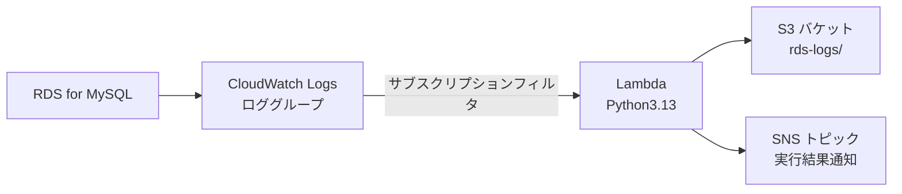
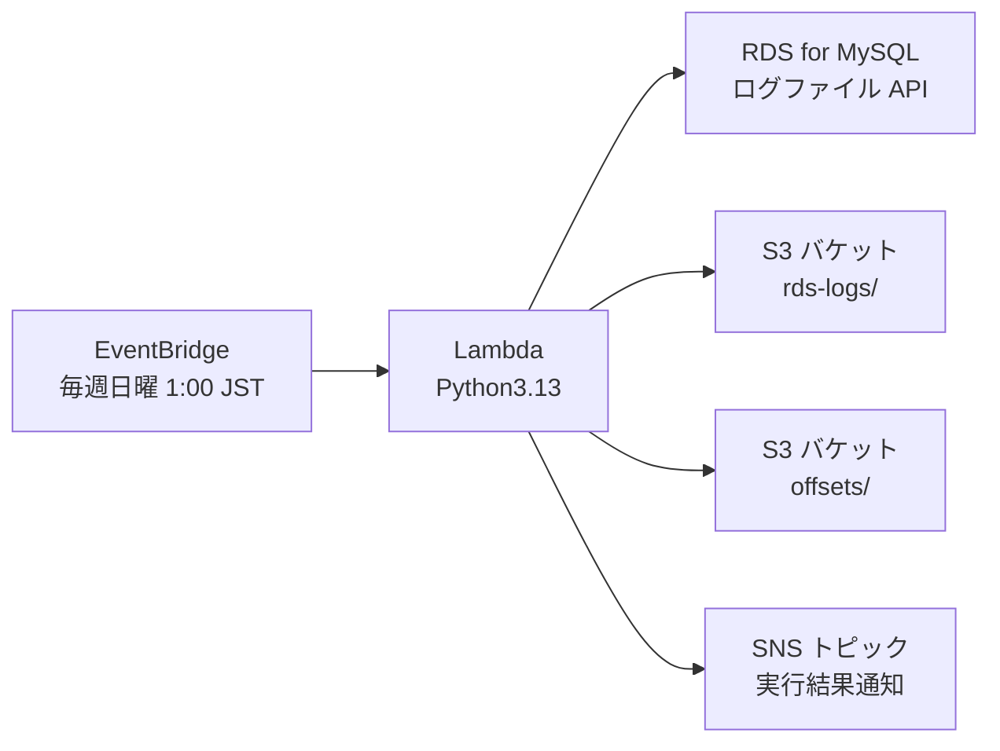

# RDS MySQL ログ収集・整形・S3 保存設計書

## 概要

本ドキュメントでは、**Amazon RDS for MySQL の SQL ログを Lambda(Python3.13) で取得・整形し、S3 に保存する運用方式**として、以下 2 パターンの設計をまとめる。

- **方式A：リアルタイムログストリーミング方式（CloudWatch Logs 経由）**
- **方式B：バッチログ取得方式（RDS API 直接取得＋S3 オフセット管理）**

業務要件としては以下を満たす。

- RDS for MySQL のログを S3 に保存する
- Lambda ランタイムは **Python 3.13**
- 処理完了時（成功 / 失敗）に **SNS で通知**
- コストは可能な限り低く抑える
- 方式Bでは、**ログとオフセット情報を同一 S3 バケットに保存**
- CloudWatch Logs の保持期間は 3 日（方式A 利用時）

---

## 方式A：リアルタイムログストリーミング方式

### 名称

**方式A：CloudWatch Logs サブスクリプション・リアルタイムストリーミング方式**

### アーキテクチャ概要

- **RDS for MySQL**
  - general / slowquery / error ログを **CloudWatch Logs** にエクスポート
- **CloudWatch Logs**
  - 対象ロググループに **サブスクリプションフィルタ** を設定し、Lambda にストリーミング
  - ログ保持期間は **3 日**
- **Lambda（Python 3.13）**
  - CloudWatch Logs からのイベントを受信
  - ログを整形し、S3 に保存
  - 処理結果（成功 / 失敗）を SNS に通知
- **S3**
  - ログアーカイブ用バケット
- **SNS**
  - Lambda の実行結果通知（SUCCESS / FAILED）

### 図（Mermaid）



### サブスクリプションフィルタの役割

- **CloudWatch Logs のロググループに対して設定する「リアルタイム転送設定」**
- 新しいログイベントが到着すると、**ほぼリアルタイムで Lambda にバッチとして送信**
- フィルタパターンを指定することで、特定のメッセージのみを Lambda に流すことも可能

#### 基本的なポイント

- **単位：ロググループごと**
- **転送先：Lambda / Kinesis / Firehose のいずれか（最大2つ）**
- **イベント形式：gzip + base64 で圧縮された JSON**
- 過去ログの再送は不可（設定後に到着したログのみ対象）

### Lambda 処理フロー（方式A）

1. CloudWatch Logs からイベントを受信
2. gzip + base64 を展開し、JSON をパース
3. `logEvents` 配列を整形（timestamp / message / logGroup / logStream など）
4. S3 に JSON として保存（例：`rds-logs/yyyy/MM/dd/<request_id>.json`）
5. SNS に「SUCCESS / FAILED」を通知

---

## 方式B：バッチログ取得方式（RDS API 直接取得）

### 名称

**方式B：RDS API バッチ取得＋S3 オフセット管理方式**

### アーキテクチャ概要

- **EventBridge**
  - **毎週日曜日 1:00（JST）** に Lambda を起動
- **Lambda（Python 3.13）**
  - `DescribeDBLogFiles` / `DownloadDBLogFilePortion` を使用して RDS のログファイルを取得
  - **S3 上のオフセットファイル（offset.json）を読み書き**し、差分のみ取得
  - ログを S3 に保存
  - 処理結果（成功 / 失敗）を SNS に通知
- **S3**
  - ログファイル保存（`rds-logs/`）
  - オフセット管理ファイル保存（`offsets/`）
- **SNS**
  - Lambda の実行結果通知

### 図（Mermaid）



※ S3_LOGS と S3_OFFSETS は同一バケット内の別プレフィックス。

### オフセット管理（S3 利用）の考え方

- RDS のログ取得 API は **Marker（読み取り位置）** を指定して差分取得する
- 「前回どこまで読んだか」を保存しないと、毎回全量取得 or 取りこぼしが発生する
- 今回は DynamoDB ではなく、**S3 に JSON ファイルとして保存**する

#### オフセットファイル例

- パス例：
  - `s3://your-log-bucket/offsets/mysql-error.log.json`
  - `s3://your-log-bucket/offsets/mysql-general.log.json`
  - `s3://your-log-bucket/offsets/mysql-slowquery.log.json`

- 中身の例：

```json
{
  "last_marker": "1234567"
}
```

### Lambda 処理フロー（方式B）

1. EventBridge により毎週日曜 1:00 に起動
2. RDS API でログファイル一覧を取得
3. 各ログファイルごとに：
   - S3 からオフセットファイル（`offsets/<logfile>.json`）を読み込み
   - `DownloadDBLogFilePortion` に Marker を指定して差分取得
   - 取得したログを S3（`rds-logs/yyyy/MM/dd/`）に保存
   - レスポンスの Marker をオフセットファイルとして S3 に保存
4. 全ファイル処理完了後、SNS に SUCCESS 通知
5. 途中で例外発生時は FAILED として SNS 通知

---

## 方式A / 方式B の比較

| 観点                 | 方式A：リアルタイムストリーミング      | 方式B：バッチ取得＋S3 オフセット |
| -------------------- | -------------------------------------- | -------------------------------- |
| リアルタイム性       | 高い（秒〜数十秒）                     | 低い（週1回）※設定次第で変更可   |
| コスト               | CloudWatch Logs が支配的で高め         | 非常に安い（数円〜十数円/月）    |
| 実装のシンプルさ     | サブスクリプション設定だけで比較的簡単 | オフセット管理が必要でやや複雑   |
| オフセット管理       | 不要（CloudWatch Logs 側で管理）       | 必要（S3 に JSON 保存）          |
| CloudWatch Logs 依存 | あり（保持期間 3 日に設定）            | なし（任意で併用は可）           |

---

## 結論と推奨

- **コスト最優先・週次バッチで十分な要件**であれば、  
  → **方式B：RDS API バッチ取得＋S3 オフセット管理方式** が最適。
- もし将来、**ほぼリアルタイムでの監視・分析**が必要になった場合は、  
  → **方式A：CloudWatch Logs サブスクリプション・リアルタイムストリーミング方式** への拡張を検討する。

================

# RDS MySQL ログ収集・整形・S3 保存 実施設計書

## 1. 目的

本ドキュメントは、Amazon RDS for MySQL から出力される各種ログ（General, Slow Query, Error）を AWS Lambda (Python 3.13) を用いて収集・整形し、Amazon S3 へ長期保存するための運用方式を定義する。

## 2. 共通要件

* **ランタイム:** Python 3.13
* **通知:** 処理の成功・失敗に関わらず Amazon SNS を介して通知を実行
* **コスト最適化:** ログ流量と要件に基づき、コストパフォーマンスの高い方式を選択可能とする

---

## 3. 方式A：リアルタイムストリーミング方式（CloudWatch Logs 経由）

### 3.1 概要

RDS のログエクスポート機能を有効化し、CloudWatch Logs (CWL) のサブスクリプションフィルタをトリガーに Lambda を起動する。

### 3.2 アーキテクチャ構成

| コンポーネント           | 役割・設定                                                                                |
| ------------------------ | ----------------------------------------------------------------------------------------- |
| **RDS for MySQL**        | ログエクスポート設定（General / Slow / Error）を有効化                                    |
| **CloudWatch Logs**      | **保持期間を 3 日に設定**（コスト抑制のため）。サブスクリプションフィルタで Lambda を指定 |
| **Lambda (Python 3.13)** | `awslogs` イベントをデコード(gzip+base64)・整形し、S3 へ PUT                              |
| **Amazon S3**            | 保存先：`s3://[BucketName]/realtime-logs/YYYY/MM/DD/`                                     |
| **Amazon SNS**           | Lambda の宛先設定（OnSuccess / OnFailure）により実行結果を通知                            |

### 3.3 方式A の特筆事項

* **リアルタイム性:** 数秒〜数十秒の遅延で S3 へ格納。
* **メリット:** オフセット（読み取り位置）管理が不要。CWL 側で自動的にリトライや順序制御が行われる。
* **デメリット:** ログ量が多い場合、CWL のデータ取り込み料金（$0.50/GB程度）が支配的になる。

---

## 4. 方式B：バッチ取得方式（RDS API 直接取得）

### 4.1 概要

EventBridge をトリガーに週次で起動。RDS API を通じて直接ログファイルをダウンロードし、前回の続きから差分を取得する。

### 4.2 アーキテクチャ構成

| コンポーネント           | 役割・設定                                                                            |
| ------------------------ | ------------------------------------------------------------------------------------- |
| **EventBridge**          | スケジュール：`cron(0 16 ? * SAT *)` ※JST 日曜 01:00                                  |
| **Lambda (Python 3.13)** | `boto3` (RDS) を使用。`DownloadDBLogFilePortion` API でログを取得                     |
| **S3 (Logs)**            | 保存先：`s3://[BucketName]/batch-logs/YYYY/MM/DD/`                                    |
| **S3 (Offsets)**         | **オフセット管理用ファイル**：`s3://[BucketName]/offsets/{InstanceID}/{LogName}.json` |
| **Amazon SNS**           | 処理完了後にログ取得件数や成否を通知                                                  |

### 4.3 オフセット管理ロジック

Lambda 実行時に以下の処理を行い、重複・漏れを防止する。

1. S3 から対象ログの `last_marker` を取得。
2. `DownloadDBLogFilePortion` の引数 `Marker` に指定して API 実行。
3. レスポンスに含まれる `AdditionalDataPending: False` になるまでループ取得。
4. 最新の `Marker` を S3 のオフセットファイルへ上書き保存。

### 4.4 方式B の特筆事項

* **コスト:** CWL を経由しないため、API 呼び出しと Lambda 実行費のみとなり極めて安価。
* **注意点:** ログファイルが RDS 上に保持される期間（デフォルト 24 時間等）に注意。週次実行の場合は RDS 側の `log_retention_period` を適切に設定（例：8日分）する必要がある。

---

## 5. 比較・選定基準

| 比較項目             | 方式A：リアルタイム           | 方式B：週次バッチ                         |
| -------------------- | ----------------------------- | ----------------------------------------- |
| **推奨用途**         | 障害検知・SIEM連携・即時分析  | コンプライアンス・長期保管・コスト重視    |
| **コスト**           | 中〜高（ログ量に比例）        | 低（ほぼ固定）                            |
| **複雑性**           | 低（AWS標準機能の組み合わせ） | 中（S3での状態管理コードが必要）          |
| **データ消失リスク** | 極めて低い                    | RDS側の保持期間設定を誤ると消失リスクあり |

---

## 6. Python 3.13 実装時の留意点

* **boto3 互換性:** Python 3.13 組み込みの `boto3` を使用。
* **型ヒント:** Python 3.13 の最新機能を活用し、`TypedDict` 等を用いた堅牢なログ整形ロジックを推奨。
* **タイムアウト設定:** 方式B の場合、大量のログファイルを扱う可能性があるため、Lambda のタイムアウト時間を十分に確保（例：5〜15分）すること。

---

## 7. 今後の展望

* **ログの秘匿化:** 保存時に PII（個人情報）を Lambda 内でマスキングする処理の追加。
* **検索基盤:** 保存した S3 ログに対し、Amazon Athena を用いた SQL 検索環境の構築。
