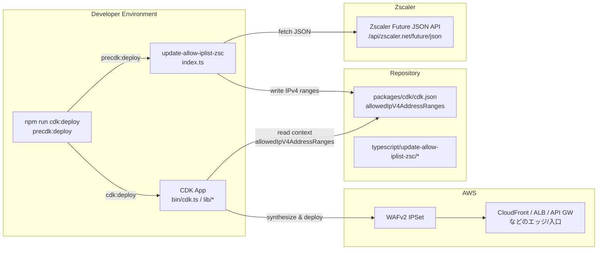
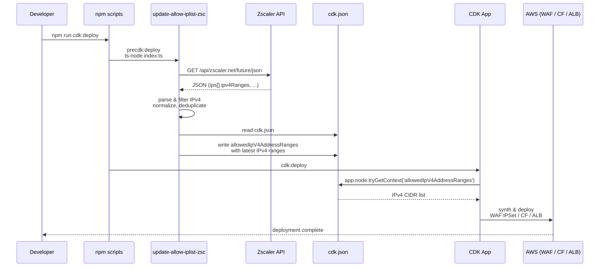
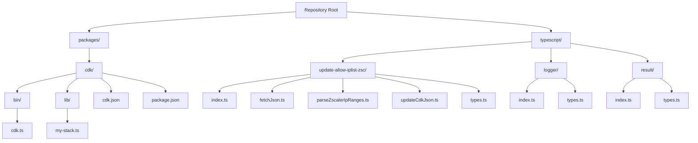

# Zscaler IP 自動取得 & CDK IP 制限更新スクリプト

Zscaler が公開している **最新の IP レンジを自動取得し、CDK の設定ファイル（`cdk.json`）へ反映する仕組み** です。

CDK デプロイ前に `update-allow-iplist-zsc` のスクリプトを実行することで、  
`allowedIpV4AddressRanges` が常に最新の Zscaler IPv4 レンジへ更新されます。

---

# 🎯 目的

- Zscaler の IP レンジは頻繁に更新される  
- **CDK デプロイ時に自動で最新 IP を反映し、手動メンテナンスを不要にする**
- セキュリティポリシーの一貫性を保ち、常に最新のアクセス制限を適用

---

# 🌐 取得する Zscaler IP 情報

以下の API から最新の IP レンジを取得します：

- https://config.zscaler.com/api/zscaler.net/future/json

取得した JSON の `ips[].ipv4Ranges` を抽出し、  
`packages/cdk/cdk.json` の `allowedIpV4AddressRanges` に反映します。

---

### 📘 全体アーキテクチャ（Mermaid：システム構成）



---

### 🔁 処理フロー（Mermaid：フローチャート）

```mermaid
flowchart TD
    A[Start<br/>npm run cdk:deploy] --> B[Run precdk:deploy<br/>ts-node update-allow-iplist-zsc/index.ts]
    B --> C[Fetch Zscaler Future JSON<br/>/api/zscaler.net/future/json]
    C --> D[Parse JSON<br/>extract ips[].ipv4Ranges (IPv4)]
    D --> E[Normalize & Deduplicate<br/>sort, unique]
    E --> F[Read packages/cdk/cdk.json]
    F --> G[Overwrite allowedIpV4AddressRanges<br/>with latest IPv4 ranges]
    G --> H[Save cdk.json]
    H --> I[Run cdk:deploy<br/>CDK App 実行]
    I --> J[CDK App reads context<br/>allowedIpV4AddressRanges]
    J --> K[Create/Update WAF IPSet<br/>and related resources]
    K --> L[Deploy to AWS<br/>CloudFront / ALB / API GW]
    L --> M[End]
```

---

### 📡 シーケンス図（Mermaid：処理シーケンス）



---

### 📁 ディレクトリ構成（最新版イメージ）

#### コードツリー（テキスト）

```text
.
├─ typescript/
│  ├─ logger/
│  │  ├─ index.ts              # 共通ロガー（info / error / debug）
│  │  └─ types.ts              # ログ関連の型
│  ├─ result/
│  │  ├─ index.ts              # Result<T, E> 実装
│  │  └─ types.ts              # 成功/失敗の型定義
│  └─ update-allow-iplist-zsc/
│     ├─ index.ts              # エントリーポイント（orchestrator）
│     ├─ fetchJson.ts          # Zscaler API から JSON 取得
│     ├─ parseZscalerIpRanges.ts # IPv4 抽出・整形
│     ├─ updateCdkJson.ts      # cdk.json 読み書き
│     └─ types.ts              # Zscaler JSON / 内部型定義
└─ packages/
   └─ cdk/
      ├─ bin/
      │  └─ cdk.ts             # CDK App（context 読み込み）
      ├─ lib/
      │  └─ my-stack.ts        # Stack（allowedIpV4AddressRanges を利用）
      ├─ cdk.json              # スクリプトが更新する context
      └─ package.json          # precdk:deploy / cdk:deploy スクリプト
```

#### ディレクトリ構成（Mermaid：構造図）



---

# ⚙️ セットアップ

### 1. 必要パッケージのインストール

```bash
cd packages/cdk
npm install ts-node typescript
```

---

# 🛠 スクリプトの役割

### `index.ts`
- 全体の orchestrator  
- fetch → parse → update の順で実行

### `fetchJson.ts`
- Zscaler API から JSON を取得  
- Result<T> で成功/失敗を返す

### `parseZscalerIpRanges.ts`
- JSON から IPv4 のみ抽出  
- 重複排除・ソート済みで返す

### `updateCdkJson.ts`
- `packages/cdk/cdk.json` を読み込み  
- `allowedIpV4AddressRanges` を上書き  
- JSON を整形して保存

---

# ▶️ 実行方法

### 通常の CDK デプロイ

```bash
npm run cdk:deploy
```

`package.json` の `precdk:deploy` により、  
デプロイ前に自動で `update-allow-iplist-zsc` が実行されます。

---

# 📜 package.json の設定例

```json
{
  "scripts": {
    "precdk:deploy": "ts-node ../../typescript/update-allow-iplist-zsc/index.ts",
    "cdk:deploy": "cdk deploy"
  }
}
```

---

# 📝 cdk.json の例

```json
{
  "app": "npx ts-node bin/cdk.ts",
  "allowedIpV4AddressRanges": []
}
```

スクリプト実行後、この配列が Zscaler の最新 IPv4 レンジで上書きされます。

---

# ⚠️ 注意点

- Zscaler API の仕様変更があった場合、スクリプト側の修正が必要
- IPv6 は現状対象外（必要なら拡張可能）
- `cdk.json` は自動上書きされるため、手動編集は非推奨
- Result<T> / Logger を利用しているため、例外ではなく安全にエラー処理される

---

# 📄 ライセンス

MIT License

## Author and Ownership

This project was created as a personal initiative and is not connected to any organization or group.  
It is published as an individual creative work.

## 著作権と所属について

本プロジェクトは個人の活動として作成したものであり、
特定の組織や団体の業務とは関係ありません。
個人の創作物として公開しています。