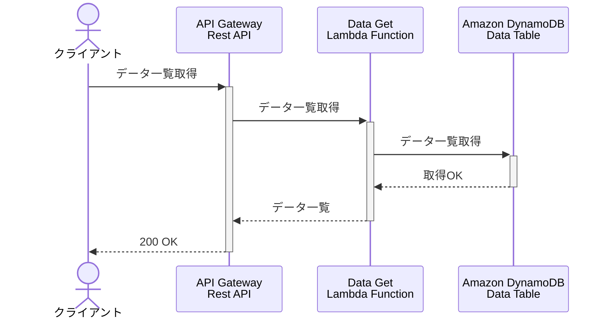
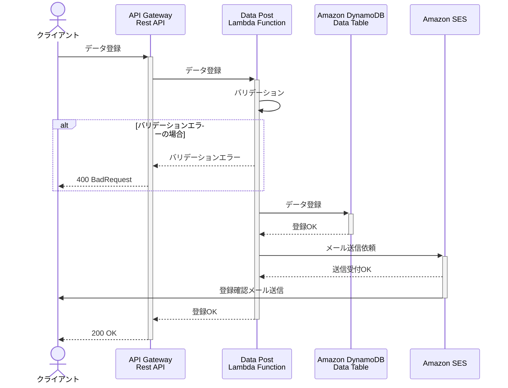
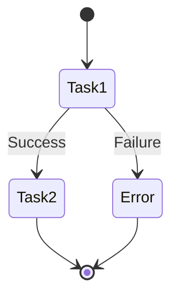
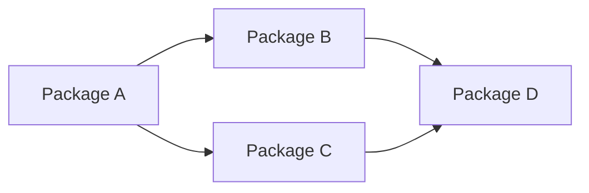
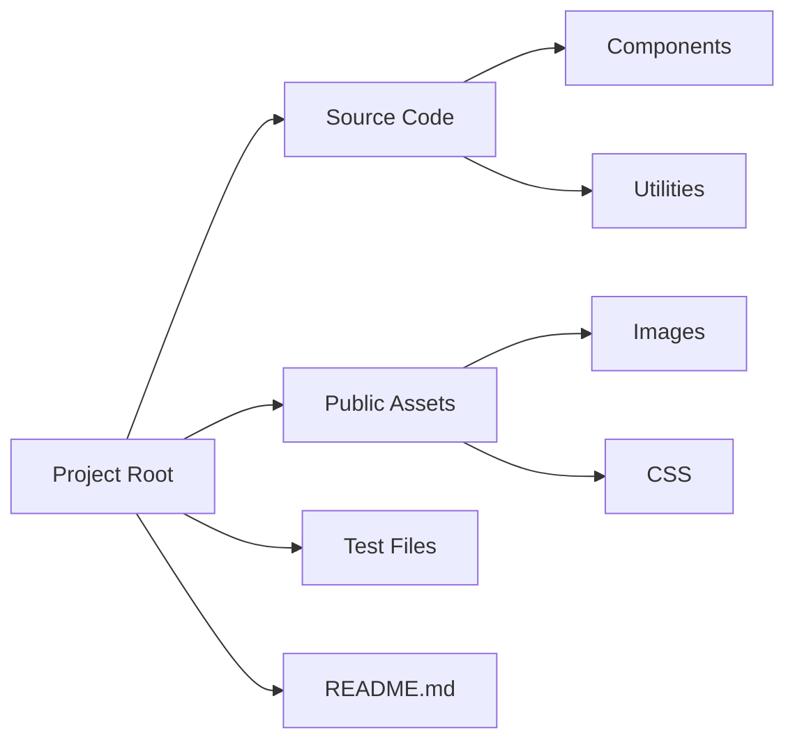
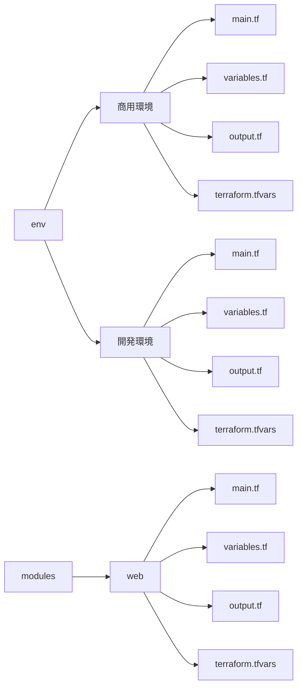
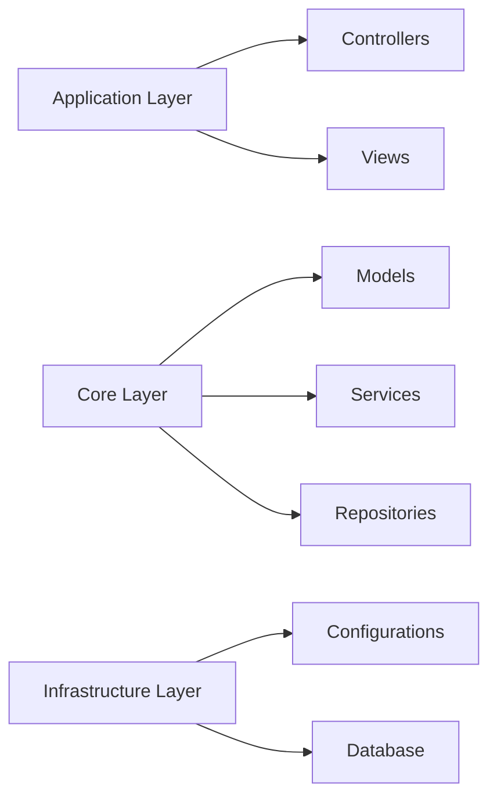
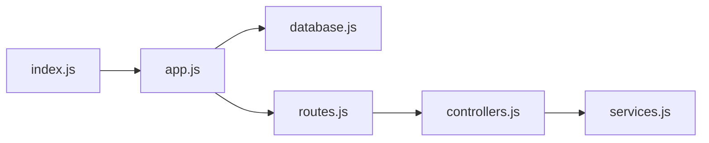
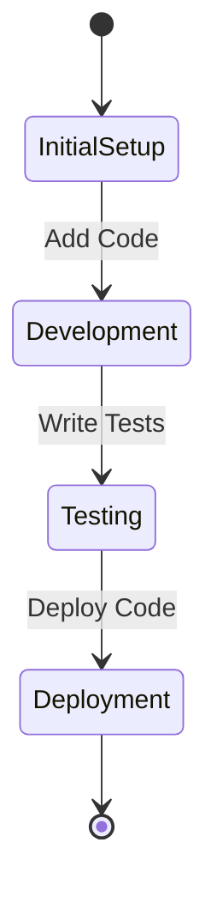
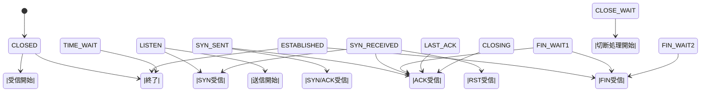

# 参考

## UML

- https://www.lucidchart.com/pages/ja/what-is-uml-class-diagram
- https://www.lucidchart.com/pages/ja/what-is-UML-unified-modeling-language
- https://www.edrawsoft.com/jp/uml-diagram-examples.html
- https://cacoo.com/ja/blog/what-is-uml/

### インストール

- https://qiita.com/incho9/items/d70e53c8d405098d0ae6
- https://adoptium.net/download/
- https://graphviz.org/download/

## PlantUML

- https://plantuml.com/ja/

## Mermaid

- https://qiita.com/ryamate/items/3779418172c4f5a83212
- https://zenn.dev/yasuhiroki/articles/dd0feae790ba41
- https://zenn.dev/iharuoru/articles/630ae2e4d7230d

## aws

### 公式

- https://github.com/awslabs/aws-icons-for-plantuml/tree/master

### qiita

- https://github.com/milo-minderbinder/AWS-PlantUML
- https://qiita.com/irongineer/items/23fcd55830ae2de96ca8#mermaid
- https://qiita.com/sakai00kou/items/18e389fc85a8af59d9e0
- https://qiita.com/yone_suke/items/7e026df29c50f9498a58
- https://zenn.dev/spiegel/articles/20211107-visualize-json-by-plantuml

## テストサンプル

- https://qiita.com/goataka/items/61384223da96c7e6c064

## その他

- https://qiita.com/Nakamura-Kaito/items/bda2003313fa33f4d818
  AI 駆動開発
- https://qiita.com/makishy/items/4dd3662a52851a2c5ddc
  AI コーディング例：Cline でアプリを作ろう！AI と協業する開発フローを体験
- https://dev.classmethod.jp/articles/cursor-cline/
  AI コーディング例：Cursor から Cline を使ってプログラミングをやってもらってみる
- https://qiita.com/watany/items/468313c602860f82fdde
  AI コーディング例：Cline ＋ Amazon Bedrock(Claude)で”国内要件”でも AI エージェントを諦めない
- https://dev.classmethod.jp/articles/aws-drawio-genai/
  AI コーディング例：生成 AI に draw.io の AWS 構成図を作図させてみた
- https://dev.classmethod.jp/articles/generative-ai-use-cases-jp-handson-basics/
  ※別もの：Generative AI Use Cases JP (GenU)を使って生成 AI を体験してみよう（基礎編）

## Mermaid

---

# パッケージ図

---

### 解説
- **パッケージ**:
  各モジュールやサブシステムをパッケージとして表現しています（例: `Package A`, `Package B`）。
- **依存関係**:
  矢印でパッケージ間の依存関係を示しています。例えば、`Package A`は`Package B`と`Package C`に依存し、それらはさらに`Package D`に依存しています。

このようなパッケージ図は、システム設計の際に構造を視覚的に把握するのに役立ちます。具体的なプロジェクトに応じてカスタマイズ可能ですので、さらに詳細な図が必要であれば教えてください！

# アクティビティ図

### 1. **ディレクトリツリー図**

---

### 2. **レイヤー構造図**

---

### 3. **ファイルの依存関係図**

---

### 4. **状態遷移の視点で表現する場合**

